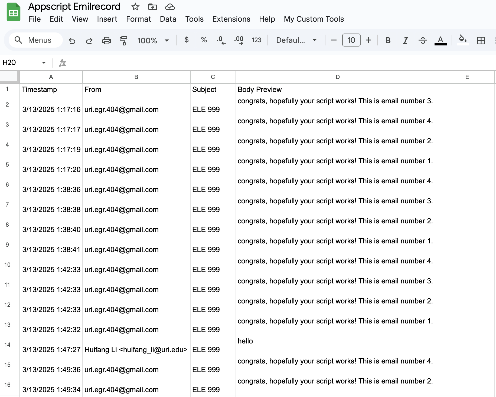
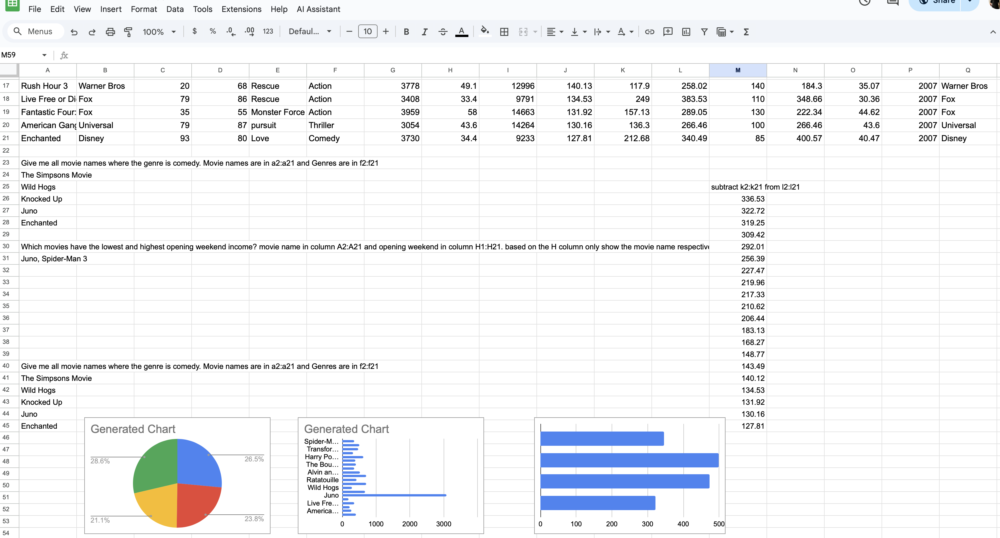
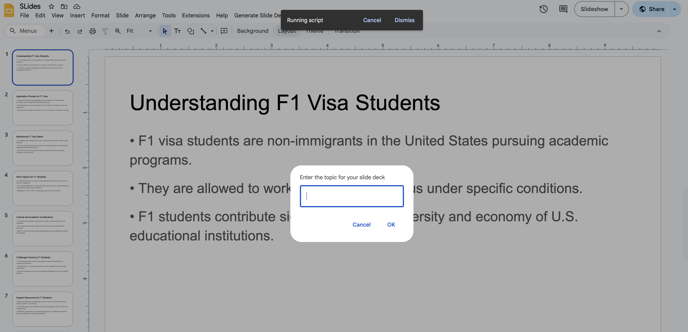

# 🤖 Google Workspace Automation using Generative AI (OpenAI GPT-4o)

This project demonstrates how to integrate **Google Apps Script** with **OpenAI’s GPT-4o** to build intelligent automation tools for **Gmail**, **Google Sheets**, and **Google Slides**. It showcases how generative AI can streamline repetitive tasks, assist with content generation, and enhance productivity directly within Google Workspace.

---

## 🔍 Overview

This repo includes three separate automation tools:

1. **Gmail Auto-Responder**  
   Automatically replies to emails based on their content and logs them into a Google Sheet.

2. **Spreadsheet Assistant**  
   Uses natural language prompts to generate formulas or charts inside Google Sheets.

3. **Slide Deck Generator**  
   Generates a full presentation from a single topic prompt using ChatGPT and Google Slides API.

---

## 💡 Features

| Tool | Description |
|------|-------------|
| **Gmail Auto-Responder** | Auto-replies to targeted emails, logs them to Sheets, and marks them as read. |
| **Spreadsheet Assistant** | Converts plain language prompts into spreadsheet formulas or charts. |
| **Slide Deck Generator** | Builds a Google Slides presentation with GPT-generated slide content. |

---

## 🧠 Technologies Used

- Google Apps Script (JavaScript)
- OpenAI GPT-4o API
- GmailApp, SpreadsheetApp, SlidesApp
- Custom UI Menus & Dialog Boxes
- Prompt Engineering

---

## 📁 File Structure

google-workspace-genai-automation/
├── gmail_responder/
│ └── Code.gs
├── spreadsheet_assistant/
│ └── Code.gs
├── slides_deck_generator/
│ └── Code.gs
├── prompts/
│ └── example_prompts.md
├── assets/
│ ├── email_output.png
│ ├── chart_demo.png
│ └── slide_preview.png
└── README.md

---

## 🚀 How to Use

1. Open the relevant Google app (Gmail, Sheets, or Slides).
2. Go to `Extensions > Apps Script`.
3. Paste the code from the corresponding folder (`Code.gs`).
4. Insert your OpenAI API key where indicated.
5. Authorize the script to run.
6. Use the custom menu ("My Custom Tools") to launch features.

---

## 📸 Example Outputs

| Email Response | Formula Generation | Slide Deck |
|----------------|---------------------|------------|
|  |  |  |

---

## 🔧 Possible Enhancements

- Add time-based triggers for automated email monitoring.
- Build a unified dashboard to access all three tools.
- Improve error handling and logging.
- Extend support to Google Docs summarization.

---

## 📄 License

This project is licensed under the [MIT License](LICENSE).

---

## 🙋‍♂️ Author

**Arindam Laha**  
Graduate Teaching Assistant | AI & Data Science Enthusiast  
[LinkedIn](https://linkedin.com/in/arindam-laha) | [GitHub](https://github.com/laha-arindam)

